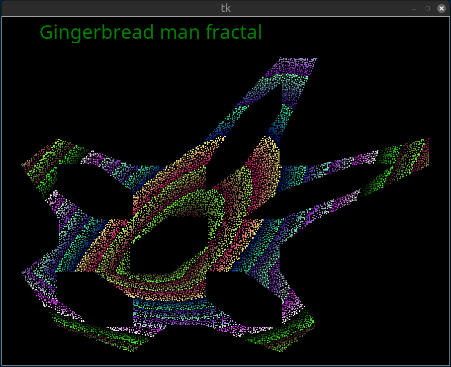

# small-Python-projects
small pieces of Python code

## mandelbrot_v1.py


This code calculates a image of the Mandelbrot set, it uses numpy for vectorized calculations and
matplotlib for display. 

This version has parameters set to view the complete Mandelbrot fractal

The image can be saved as png image file

## mandelbrot_v1_detail.py


This code calculates a image of the Mandelbrot set, it uses numpy for vectorized calculations and
matplotlib for display. 

This version has parameters set to view a detail of the Mandelbrot fractal

The image can be saved as png image file

## julia_v1.py


A modification of the Mandelbrot code allows to calculate the Julia set.

## logistic_map_calculate_image_v3.py


This code calculates an image of the bifurcation diagram for the logistic map.
```
 Xn+1 = a. Xn.(1 - Xn)
```

Iterations are done for increasing values of 'a', the logistic map is represented as a Numpy array

The image of the map is displayed using Matplotlib and can be saved as a PNG image file.

## kings_dream_cpython.py


This script draws the fractal defined by iterating the x,y values through the following function

        x = sin(a*x) + b*sin(a*y)
        y = sin(c*x) + d*sin(c*y)

with constants of 

        a = 2.879879
        b = -0.765145
        c = -0.966918
        d = 0.744728

and initial values of x=2, y=0 

The image can be saved as PNG file.
The script uses the numpy, matplotlib and math libraries.

## hopalong.py


A variation of the code for the 'King's dream fractal' yields this 'hopalong' fractal.
This script draws the fractal defined by iterating the x,y values through the following function

        x = y - 1 - sqrt(abs(bx - 1 - c)) . sign(x-1)
        y = a - x - 1

Initial values are 0.0 for x and y
The parameters a,b,c can be any value between 0.0 and 10.0. A lot of combinations seem to give an intresting fractal

## tinkerbell.py


A variation of the code for the 'King's dream fractal' yields this 'tinkerbell' fractal.
This script draws the fractal defined by iterating the x,y values through the following function

        x = x² -y² +ax + by
        y = 2xy + cx + dy

with constants of 

        a = 0.9
        b = -0.6013
        c = 2.0
        d = 0.5

and initial values of x=0.01, y=0.01

The image can be saved as PNG file.
The script uses the numpy, matplotlib and math libraries.

## quadrup_two.py


A further variation of the code for the 'King's dream fractal' yields the 'Quadrup Two' fractal.
This script draws the fractal defined by iterating the x,y values through the following function

        x = y - sgn(x) * sin(ln|b * x - c|) * atan( (c * xn - b)2 )
        y = a - x

with constants for example, they can be varied to give different fractals

        a = 34
        b = 1
        c = 5

and initial values of x=0, y=0

The image can be saved as PNG file.
The script uses the numpy, matplotlib and math libraries.

## Gumowski_Mira.py


This Gumowski-Mira fractal seems very sensitive to parameter and intial values.
This script draws the fractal defined by iterating the x,y values through the following function

        f(x) = ax + 2(1-a). x² / (1+x²)²
        xn+1 = by + f(xn)
        yn+1 = f(xn+1) - xn

with constants for example, they can be varied to give different fractals

        a = -0.7  a should be within [-1,1]
        b = 1.0 should be 1.0 (or very close?)

and initial values of x=-5.5, y=-5.0, they should be in [-20,20]

The image can be saved as PNG file.
The script uses the numpy, matplotlib and math libraries.
 
## sierpinski_triangle_tkinter_v6.py


Sierpinski Triangle constructed using the Chaos game method. 
It rotates and scales in and out.
The triangle is drawn on a tkinter canvas widget.

## pascal_triangle_ansi.py


This code calculates the first 32 rows of Pascal's triangle.
It then prints the last digit of each value
by marking if that digit is uneven, the Sierpinski triangle appears.
This version uses ANSI escape codes to generate colors and reverse characters

## pascal_triangle_no_ansi_v2.py

This code calculates the first 32 rows of Pascal's triangle
It then prints the last digit of each value
by marking if that digit is uneven, the Sierpinski triangle appears.
This version avoids using ANSI escape codes by reprinting the triangle
using a character in place of uneven values

## logistic_map_test_v2.py


Generating a bifurcation diagram of the Logistic Map.
using Numpy and Matplotlib

## gingerbread_CPython.py


This script draws a “Gingerbread man” fractal. The shape is generated by applying a simple iteration and plotting the x,y values. It has an extra function which keeps track of the distance between successive x,y points in the iterations, this is used to derive the color of the points to make the fractal look more interesting visually. It uses Tkinter for plotting also the math library.

## recursive_tree_canvas_v4.py

 
 Drawing recursive trees on a Tkinter canvas. Four different looking
 trees are drawn using the same code with different parameters.
 Function branch() draws one branch and calls function start_new_branches().
 Function start_new_branches() calls branch() three times to draw branches
 with different angles. Recursion depth is controlled by parameter number_of_recursions

## pi_monte_carlo_circle.py
 

Monte Carlo approximation of PI, using Python and Numpy. 
A series of points with random x,y coördinates are calculated, whether they fall inside the unit circle can be used to approximate the value of PI. Calculations are done in a series of parts called intervals. The code keeps track of the successive PI approximations taking the extra data into account after each interval, it prints a table and plots a graph. 

## perimeter_ellipse_v4.py


Three methods to approximate the Circumference of an ellipse, using Python + Scipy + Numpy + Matplotlib
The Circumference of a series of elipses with identical surface area is calculated,
the shape ranging from a circle to the flattest ellipse.
Using the complete elliptic integral of the second kind function ellipe() and
the Binomial coefficients function binom() from scipy.special.

## wbridge.py

Calculate output voltage of a Wheatstone Bridge as function of one
variable resistor Rx using Kirchhoff circuit laws and left division operator with a matrix and vector.
Made to compare code with a GNU Octave script doing the same calculations: [wbridge.m](https://github.com/oonap0oo/GNU_Octave_scripts/blob/23891978e31cf807bc051fc30719fc4f2e71cebe/wbridge.m)

## lorenz_system_scipy_numpy_v2.py


This code calculates a solution for the Lorenz System with the system parameters sigma = 10, beta = 8.0 / 3.0, rho = 28.0.
It uses the Scipy function scipy.integrate.solve_ivp() to solve the system of ODEs. A series of plots is created using matplotlib.
Showing the three variables x, y and z vs time and also a 3D line plot.

## runge_kutta_python_code_exp_decay.py


Comparing three methods to solve a ODE:
* First-order Euler method, coded directly in Python
* Fourth-order Runge-Kutta method, coded directly in Python
* Scipy function solve_ivp()
Using a a simple exponential decay system because it has an
exact solution: N(t) = Nₒ.exp(-λ.t)
Comparing the results with the exact values and mesuring the execution time
using time.perf_counter().
Plots are made using matplotlib.

## fourier_series_v4.py


This code calculates the coefficients of the Fourier Series of a number
of functions.
* square_wave
* pulse
* sawtooth
* the absolute value of a sine function
* a chopped sine function
* a half sine function

Each function is plotted with their approximations using several numbers 
of coefficients. Also the Fourier Series coefficients themselves are plotted. 
The code uses the function integrate.quad() from the Scipy library to calculate the various
integrals. The plots are made using Matplotlib, Numpy is also used.

## scipy_convolution_sallen_key_lpf_v2.py


This code defines the transferfunction of an example VCVS Sallen-Key active analog low pass filter
as function of s.
It uses the information to: 
* calculate the impulse response using Scipy function signal.impulse()  
* calculate the frequency response using scipy function signal.bode()
* calculate the output signal as function of time for two types of input signals. It performs a convolution of the input signals and the impulse response using scipy function signal.convolve()

The input signals are a square wave generated using Scipy function signal.square() 
and a sawtooth generated using Scipy function signal.sawtooth().

Graphs are made using matplotlib. Calculations use numpy arrays.

## simple_linear_regression_dataset_v2.py


This code explores 4 different methods for simple linear regression in Python
It uses a function directly coded in Python:
1. From python's statistics library: function statistics.linear_regression()
2. From the Numpy library function numpy.polynomial.polynomial.Polynomial.fit()
3. From the Scipy library function nscipy.stats.linregress()
4. It plots the xy data and the linear regression lines

It displays a table using matplotlib underneath the plot 
the test data is the duration of one swing for different lengths of a pendulum

## monte_carlo_circuit.py


MONTE CARLO ANALYSIS USING PYTHON, NUMPY AND MATPLOTLIB
this code performs a Monte Carlo analysis of a voltage divider with two resistors
Numpy is used to generate the random values with a normal distribution
matplotlib is used to generate the plot

## lotka_volterra_predator_prey_model_v2.py


This code calculates some solutions to an example Lotka–Volterra predator–prey model. 
Function solve_ivp() is used from module Scipy to calculate solutions for 3 different initial conditions.
The result is plotted as function of time and in a phase-space plot using Matplotlib.

## buffons_needle_pi_approximation.py


This code uses Buffon's needle problem to approximate PI. A number of needles is randomly dropped on the floor.
By keeping track of the number of needles touching a set of parallel lines PI can be approximated. It is a Monte Carlo method.

## pendulum.py


Damped, driven pendulum

This script calculates a solution to the ODE for a driven pendulum with damping. 

    I*d(dθ/dt)/dt + m*g*l*sin(θ) + b*dθ/dt = a*cos(Ω*t)

This second order non linear ODE has been to be modified to a system of two first order ODEs. 

    dω/dt = 1/I*( -g*m/l*sin(θ) - b*ω + a*cos(Ω*t) )
    dθ/dt = ω

The script uses a 4th order Runge-Kutta method solve_ivp() from scipy.integrate to calculate a solution of this system.

## batch_resizer.py

This python code resizes all supported image files in a directory.
The resized version of the images are saved as new image files.


## decimal_degrees_to_dms.py
Contains one function that takes an angle as float and returns degrees, minutes, seconds as tuple
A second function takes tuple of  degrees, minutes, seconds and returns string representation   

## pasword_generator _v2.py
generate a password of given length containing numbers, upper case letters,
lower case letters and optionally symbols

## function_sortandfilter_v2.py
function which accepts a list of strings, removes duplicates, sorts alphabetically
and fiters using a optional search string

## class_color_code.py
contains three class definitions:

### class resistor()
contains code to find the value of a resistor 
out of the color codes present on the component
can return a tuple containing (value, tolerance) as values
or a string representation such as "12 MOhm 5%"

### class resistance()
contains code to find the colorband colors
out of the value and tolerance of the component
both for sets of 4 and 5 colorbands 

### class colors
contains dictionaries to facilitate printing in
color in the console using ANSI escape sequences

## get_color_codes.py
find the color code of a resistor using the classes in class_color_code.py
prints the color bands in color on a console using ANSI escape sequences.

## get_value_from_color_codes.py
find the value and tolerance of a resistor based on the color bands.
It uses the classes in class_color_code.py and prints color bands in color
using ANSI escape sequences.

## several_methods_fibonacci_sequence_v2.py
These 6 different Python functions generate the same list containing a specified number of Fibonacci numbers.
Included are a generator function, recursive functions with and without memoization, 
a function from the sympy library and Binet's formula, a closed-form expression.

##  roman_numerals_v2.py
This code converts a roman numeral in standard form to an integer


